# 世界书详解

欢迎来到世界书的深度探索之旅！这篇文档将从零开始，一步步带你了解 SillyTavern 中强大的世界书 (World Info / Lorebook) 功能。我们的目标不仅是让你知道世界书**是什么**，更要让你理解它**为什么这样工作**，以及**如何高效使用**它，真正做到<mark>知其然，知其所以然</mark>。

在正式介绍以前，首先感谢[凝霜大佬](https://t.me/NShuang)提出的宝贵意见，让这篇文章得以诞生。

***

## 第一章：初识世界书

### 1.1 什么是世界书？

> 世界书本质上是一个可自定义的信息数据库，你可以在其中存储关于你的角色扮演世界、角色、地点、事件、物品、规则、背景故事等任何你想让 AI 了解和“记住”的信息。

简单来说，你可以把“世界书”想象成一本专门为你和 AI 共同创作的故事准备的：

* **专属“教材”**：当你的故事中出现了 AI 知识库里没有的原创设定时，世界书就是 AI 的学习资料。

* **动态“维基百科”**：它记录着你世界中的一切关键信息，方便 AI 随时查阅。

* **上下文“提示卡”**：在合适的时机，它会把相关信息“递”给 AI，帮助 AI 做出更符合设定的回应。

### 1.2 为什么我们需要世界书 ？

大型语言模型 (LLM)，也就是我们与之对话的 AI，虽然聪明，但它们有两个主要的“弱点”：

1. **有限的知识库：** AI 的知识是基于它训练时所用的数据。对于你独创的组织、角色、地点、魔法体系，甚至是某些冷门但对你故事重要的现实知识，AI 可能一无所知。
   
   * **场景还原：** 你在角色描述中提到角色隶属于一个名为“暗影之刃”的刺客组织。当 AI 看到“暗影之刃”时，它可能会：
     
     * 一脸茫然：“暗影之刃？这是什么？我的数据库里好像没有……”
     
     * 胡编乱造：“哦，我知道！暗影之刃是一个著名的……呃……美食家协会！”（然后你的严肃故事就跑偏了）
   
   * **世界书的作用：** 如果你在世界书中定义了“暗影之刃是一个由精英刺客组成的秘密组织，致力于维护世界的平衡，他们的信条是……”，那么 AI 就能“学习”到这个设定，并做出符合你预期的互动。

2. **有限的上下文窗口 (Context Window)：** 这是 AI 的“短期记忆”容量。AI 只能记住最近的一段对话内容。对于长篇的角色扮演故事，那些在几十甚至几百条消息之前设定的重要细节，AI 很容易就忘得一干二净。
   
   * **场景还原：** 你在故事早期设定了一个重要的NPC，但很久没有提及。当你再次提到TA时，AI 可能已经完全不记得TA是谁，或者TA的性格、外貌、与主角的关系了。
   
   * **世界书的作用：** 世界书通过在对话中检测到相关关键词（比如NPC的名字），然后自动将该NPC的信息重新注入到 AI 的“短期记忆”中，帮助 AI “回忆”起来。

**所以，世界书的核心价值在于：**

* **赋予 AI “知识”：** 让 AI 了解你世界的独特设定。

* **增强 AI “记忆”：** 帮助 AI 记住长篇故事中的关键细节。

* **提升故事连贯性：** 确保 AI 的行为和回应与先前设定保持一致。

* **深化角色扮演沉浸感：** 让你和 AI 的互动更加真实可信。

***

## 第二章 所以，世界书该怎么做？

说完了嘴皮功夫，相信读者应该都意识到了世界书的重要性了，所以世界书到底该咋做？

那么现在，请各位读者先抛弃自己的大脑....额，一小会就好，我们需要一股脑往前冲一下！


首先请读者在SillyTavern的顶部工具栏找到世界书的图标： 

点击这个图标，我们会看到以下界面：

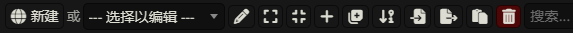

然后我们点击这个图标： 可以新建一个世界书。

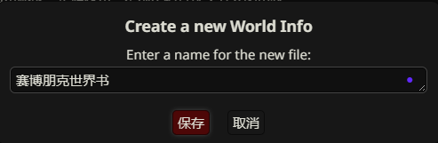

在这个界面我们为世界书起一个名字，这里我将其取名为**赛博朋克世界书**，随后我们点击保存，来到这个界面：

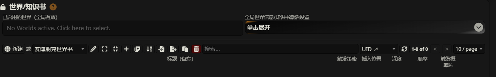

呼~
我们现在可以歇一歇了，恭喜各位读者，已经成功创建了一个**世界书**！

不过...我们可以看到这个界面似乎看起来凶巴巴的，乱七八糟的图标，各种专有名词似乎都在让我们望而却步，不过不要担心，马上你就会对他们知根知底了。

接下来让我们看一看世界书的重要组成部分！

### 2.1 世界书的组成部分：

世界书由许多独立的“条目”组成的，它就像一个字典，每个条目就像一个个单词。

**创建条目：**

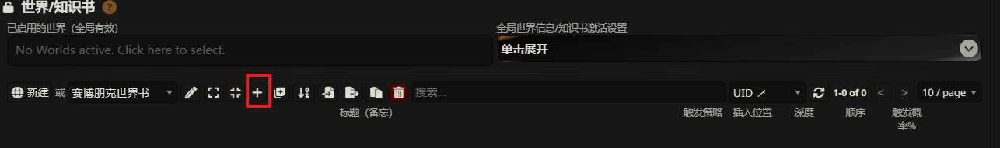

在这个界面中，我们找到这个图标： 点击它，我们会看到这个界面：

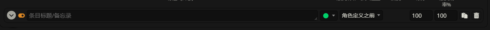

恭喜你，你现在已经成功创建了一个条目了！

不过现在，请让我们点击这个图标： 我们将会看到以下界面：

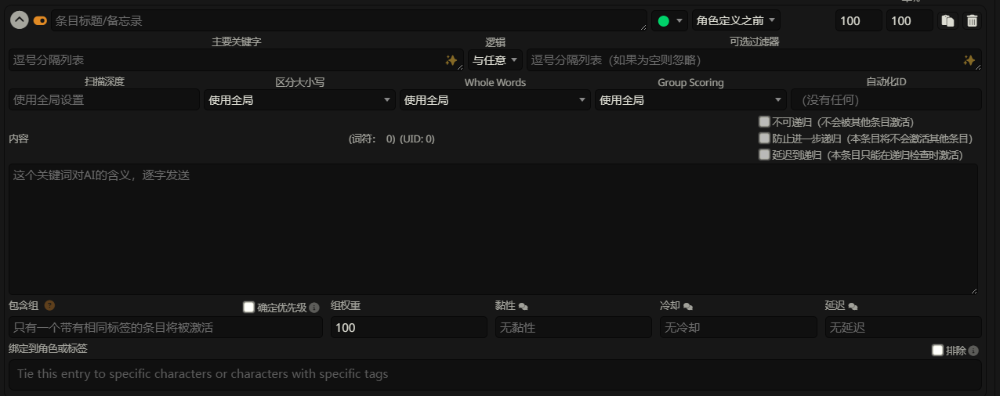

<mark>好！先别跑！</mark>

让我们先把刚才丢掉的脑袋捡回来！

我知道现在这个界面看上去有些<mark>“丑陋”</mark>，让我为各位读者做一个简单的优化！

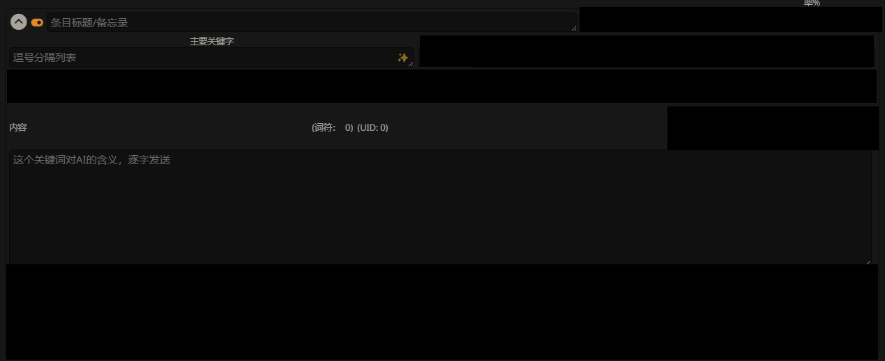

嗯！很好！舒服多了！

现在这个界面是条目的主界面，每一个条目看上去有很多个部分，但其核心就只有两个：

* 条目标题：其实就是条目的名字，比如：沃森区

* **主要关键字：**
  
  * **作用：** 这是激活条目的“扳机”。它们是你期望在对话中出现的词语或短语。
  
  * **格式：** 通常是用英文逗号(在dzmm中中文逗号也是可以的)分隔的一系列词语。例如：沃森区, 东北夜之城, 半岛。
  
  * **匹配方式：** 可以是精确匹配，也可以在某些高级设置下使用模糊匹配或正则表达式。

* **内容 ：**
  
  * **作用：** 这是当条目被激活时，实际注入到 AI 提示中的文本信息。这部分内容就是你想让 AI “知道”的具体信息。
  
  * **格式：** 可以是纯文本，也可以使用一些简单的格式化，如 Markdown。
  
  * **示例：**
    
    ```context
    沃森区位于夜之城的东北部分，与市中心隔海相望，主要由三座半岛和人工岛屿组成。原为亚裔（主要是日本和中国）移民聚居地，曾是繁荣的商业和居住区域。第四次企业战争和荒坂塔爆炸后，区域快速衰落，现已成为高犯罪率的危险地区。城市重建计划多次推迟，导致许多地区仍处于破败状态。
    ```

我们将上面的示例内容，添加到条目中，即可完成一个条目的创作，就像这样：

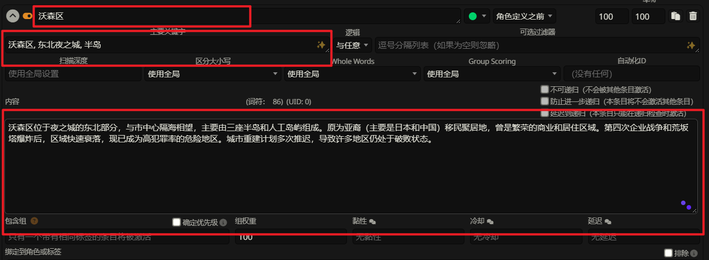

怎么样？不算困难吧？

还记得我们在《SillyTavern入门》中的第二章的案例2吗？

现在让我们把世界书链接到案例2的角色卡中！

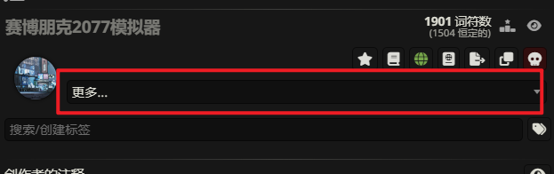

点击更多

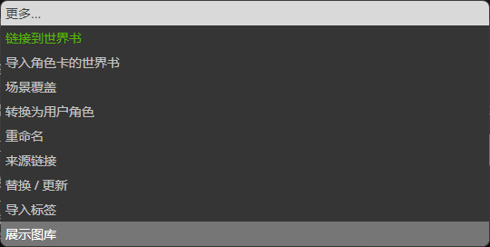

在这里选择**链接到世界书**

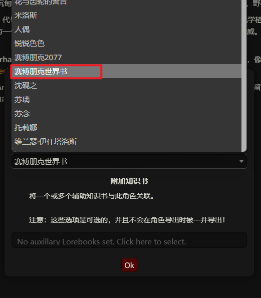

选择我们创建的**赛博朋克世界书**

这样我们就将一个世界书关联在角色上了。

当我们与角色对话或聊天时，只要提到**关键词**的内容：**沃森区**, **东北夜之城**, **半岛**

那么AI便能得到相应条目下的内容：

```context
沃森区位于夜之城的东北部分，与市中心隔海相望，主要由三座半岛和人工岛屿组成。原为亚裔（主要是日本和中国）移民聚居地，曾是繁荣的商业和居住区域。第四次企业战争和荒坂塔爆炸后，区域快速衰落，现已成为高犯罪率的危险地区。城市重建计划多次推迟，导致许多地区仍处于破败状态。
```

不过，这里不禁要问，为什么？

为什么我提到关键词才能触发这个条目？

为什么不能让AI一直知道这个条目？

如果我提到与关键词或条目内容相关的东西能不能触发该条目？

下面让我们一一为止解答！

### 2.2 如何“唤醒”条目

首先让我们回到**赛博朋克世界书**

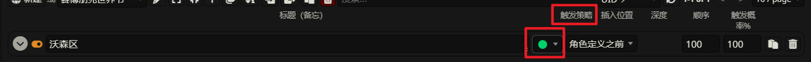

让我们先关注一下这个🟢绿色的玩意。

这个玩意在社区中一般称其为“绿灯”，是一种触发策略。

除了绿灯之外，还有🔵“蓝灯”，🔗“向量化“这两种触发策略。

现在让我为各位读者一一介绍。

**1. 绿灯🟢**

* **含义：** 这是最基础的触发方式。你需要为每个世界书条目设置一个或多个**关键词 (Keywords)**。

* **工作原理：** SillyTavern 会持续扫描最近的聊天记录（扫描深度可配置）。当对话中出现了与某个条目设定的关键词完全匹配（或部分匹配，取决于设置）的词语时，该条目就会被“激活”，其内容会被注入到下一个发送给 AI 的提示中。

* **优点：**
  
  * **精确控制：** 你可以精确指定何时触发某个条目。
  
  * **资源友好：** 相对不消耗计算资源。

* **缺点：**
  
  * **依赖关键词：** 如果对话中没有出现预设的关键词，即使内容相关，条目也不会触发。
  
  * **维护成本：** 需要仔细思考和维护关键词列表，确保覆盖所有相关场景。

* **示例：**
  
  * 条目：关于“龙之洞穴”
  
  * 关键词：龙之洞穴, 龙穴, 巨龙巢穴
  
  * 当你说“我们去龙之洞穴探险吧”，此条目会被激活。

**2. 蓝灯🔵**

* **含义：** 这种模式下，条目**始终被激活**，无论对话中是否出现特定关键词。它的内容会无条件地添加到发送给 AI 的每个提示中（除非你手动暂时禁用该条目）。

* **工作原理：** 不需要关键词匹配。只要条目启用了“蓝灯”模式，它就会一直生效。

* **优点：**
  
  * **确保核心信息：** 对于那些 AI 必须时刻记住的核心信息（比如主角的核心身份、世界的基本规则），这非常有用。
  
  * **无需操心触发：** 不用担心关键词是否被提及。

* **缺点：**
  
  * **占用上下文空间：** 由于总是注入，会持续占用宝贵的上下文窗口空间，可能导致其他信息被挤出。
  
  * **可能不相关：** 有时注入的信息可能与当前对话上下文并非强相关，造成冗余。

* **示例：**
  
  * 条目：主角是精灵王子。
  
  * 设置为“蓝灯”，这样 AI 在任何时候都会被提醒主角的身份。

**3. 向量化🔗**

这是最复杂也最智能的一种触发方式。

* **含义：** 它不再依赖于精确的关键词匹配，而是基于**语义相似度 (Semantic Similarity)** 来决定是否激活一个条目。即使对话中没有出现条目设定的关键词，但如果对话的**含义**与条目的内容**相似或相关**，条目也可能被激活。

* **工作原理：**
  
  1. **嵌入：**
     
     * 首先，当你启用向量化世界书功能时，SillyTavern (或其后端，如 KoboldAI / Oobabooga Text Generation WebUI 等) 会使用一个**嵌入模型 (Embedding Model)** 将你的每一个世界书条目的**内容**（有时也包括其关键词）转换成一个**向量 (Vector)**。向量是一个由数字组成的列表，它代表了文本的语义信息在多维空间中的一个点。
     
     * 简单来说，语义上相似的文本会被转换成在向量空间中彼此靠近的向量。
  
  2. **存储/索引：** 这些生成的向量会被存储在一个**向量数据库 (Vector Database)** 或索引中，以便快速检索。
  
  3. **查询与匹配：**
     
     * 当有新的对话产生时，SillyTavern 会取最近的一段对话内容（作为“查询文本”）。
     
     * 这个查询文本也会被同一个嵌入模型转换成一个向量。
     
     * 然后，系统会在向量数据库中搜索，找出那些与查询向量**最相似**的世界书条目向量。相似度通常通过计算向量间的距离（如余弦相似度）来衡量。
  
  4. **激活：** 如果某个世界书条目的向量与当前对话的向量之间的相似度超过了设定的阈值 (Threshold)，该条目就会被激活，其内容会被注入提示。

* **优点：**
  
  * **更智能、更灵活：** 不再局限于死板的关键词。能理解同义词、相关概念。例如，如果条目是关于“国王的城堡”，对话中提到“皇宫”、“王室居所”或“君主的要塞”，即使没有“城堡”这个词，条目也可能被激活。
  
  * **减少关键词维护：** 在某些情况下，可以减少对详尽关键词列表的依赖。
  
  * **发现意外的关联：** 有时能发现你未曾想到的相关信息。

* **缺点：**
  
  * **计算资源消耗：** 生成嵌入和进行向量搜索比简单的关键词匹配更消耗 CPU/GPU 资源，尤其是在首次建立索引或世界书条目很多时。
  
  * **设置和配置：** 可能需要下载和配置嵌入模型，并调整相似度阈值等参数以获得最佳效果。
  
  * **“黑盒”效应：** 有时可能难以精确理解为什么某个条目被触发或未被触发，因为语义匹配不如关键词匹配那么直观。
  
  * **准确性依赖模型：** 效果高度依赖于所使用的嵌入模型的质量。
  
  * **可能误触发：** 如果相似度阈值设置不当，或嵌入模型理解有偏差，可能会激活不完全相关的条目。

* **示例：**
  
  * 条目内容：“阿卡拉女巫是村里唯一会治疗魔法的人，她住在森林边缘的小屋里。”
  
  * 对话：“我受伤了，村里有人能帮我治疗吗？”
  
  * 即使没有“阿卡拉”或“女巫”这些词，向量化系统也可能因为“受伤”、“治疗”、“村里”等语义关联而激活该条目。

**总结对比：**

| 特性        | 绿灯 (Keyword)    | 蓝灯 (Always On) | 向量化 (Semantic)            |
| --------- | --------------- | -------------- | ------------------------- |
| **触发机制**  | 精确关键词匹配         | 始终激活           | 语义相似度匹配                   |
| **灵活性**   | 低               | (不适用，总是激活)     | 高                         |
| **控制精度**  | 高               | (不适用，总是激活)     | 中到高 (取决于阈值和模型)            |
| **资源消耗**  | 低               | 低 (但持续占用上下文)   | 中到高                       |
| **设置复杂度** | 低               | 非常低            | 中到高                       |
| **适用场景**  | 特定事件、物品、地点等明确概念 | 核心角色身份、世界基础规则  | 宽泛概念、隐晦关联、希望更智能地捕捉上下文相关信息 |

相信经过上面的介绍，各位读者应该对**触发策略**有了一个清晰的认知，不过新的问题很快到来，总共有三种触发策略，究竟要选择哪一种呢？

我相信大多数读者可能会无脑选择蓝灯🔵，因为它不需要关键词，操作难度极低，且能一直触发。

但也要清楚蓝灯🔵虽好，缺点也是极大，下面我将提供一些**触发策略**的选取建议。

### 2.3 如何选择触发策略

**1. 绿灯🟢 (关键词触发)：作为默认和首选**

* **适用场景：**
  
  * **绝大多数具体设定：** 角色名称、特定地点名称、组织名称、物品名称、特定技能或法术名称、已发生的具体事件等。这些通常都有明确的词语可以在对话中提及。
  
  * 当信息与特定的、可预测的词语强相关时。

* **优点：**
  
  * 精确控制，只在需要时激活。
  
  * 对上下文空间最友好（仅在激活时占用）。

* **建议：**
  
  * **关键词的选择是关键：**
    
    * **核心词：** 包含最直接的名称。
    
    * **同义词/别称：** 考虑所有可能的叫法。例如，“光明圣殿”也可能是“圣殿”、“教会总部”。
    
    * **相关行动/概念：** 有时，与该条目相关的动词或概念也可以作为关键词。例如，一个关于“隐身药剂”的条目，关键词可以是 隐身药剂, 隐形药水, 喝下药剂, 变得透明。
    
    * **避免过于宽泛的词：** 像“他”、“它”、“那个”通常不适合做关键词。
  
  * **扫描深度 (Scan Depth)：** 根据信息的重要性和你希望它“持续”多久来调整。一般3-10条消息是一个不错的范围。

**2. 蓝灯 🔵(Always Active / Force Enable - 始终激活)：谨慎使用**

* **适用场景：**
  
  * **绝对核心、AI必须时刻铭记的信息：**
    
    * 主角的核心身份或状态，例如：“{{user}} 是被放逐的王子，正隐姓埋名。”
    
    * 世界观的根本法则，例如：“这个世界没有魔法，所有超自然现象都是科技的伪装。”
    
    * 当前阶段最重要的、持续性的任务目标，例如：“当前首要目标：找到失落的圣物。” (当任务完成后应禁用或修改此条目)
    
    * AI 角色自身的核心设定，如果角色卡中难以完全表达或需要特别强调的部分。
  
  * 当你希望某条信息在**每一轮**对话中都对 AI 产生影响时。

* **优点：**
  
  * 确保信息传递，不会因为关键词未出现而遗漏。

* **缺点：**
  
  * **持续占用上下文空间：** 这是最大的问题。如果“蓝灯”条目过多或内容过长，会严重挤占其他重要信息（如聊天历史、其他关键词触发的条目）的空间，可能导致 AI 表现下降。
  
  * 可能在某些对话轮次中显得多余或不相关。

* **建议：**
  
  * **极简内容：** “蓝灯”条目的内容一定要尽可能简洁，只保留最核心的关键词和信息。
  
  * **严格筛选：** 问自己：“这条信息真的有必要让 AI 在每时每刻都知道吗？”如果答案不是绝对肯定，就优先考虑“绿灯”或“向量化”。
  
  * **数量限制：** 尽量将“蓝灯”条目的数量控制在极少数（例如，1-3个）。

**3. 向量化🔗 (语义触发)：作为关键词的补充或替代**

* **适用场景：**
  
  * **概念性/描述性信息：** 当信息不是由特定名称触发，而是与某种氛围、情感、抽象概念或一类行为相关时。例如，一个描述“森林深处的诡异氛围”的条目。
  
  * **当关键词难以穷举时：** 对于一些宽泛的主题，你可能很难列出所有相关的关键词。向量化可以帮助捕捉到那些你没想到的相关表述。
  
  * **希望 AI 更“智能”地联想：** 当你希望 AI 能理解近义词、相关概念，而不仅仅是字面匹配。
  
  * **作为“绿灯”的补充：** 你可以为一个条目同时设置关键词和启用向量化。这样，即使关键词没匹配上，如果语义相关，条目仍可能被激活。

* **优点：**
  
  * 更灵活，能理解语义。
  
  * 减少对精确关键词的依赖。

* **缺点：**
  
  * 计算资源消耗相对较高。
  
  * 配置（如嵌入模型、相似度阈值）需要调整才能达到最佳效果。
  
  * 有时触发逻辑不如关键词明确，可能出现“意外”触发或不触发。

* **建议：**
  
  * **从辅助开始：** 可以先尝试用它来补充关键词触发，看看效果。
  
  * **调整阈值：** 相似度阈值 (Threshold) 很关键。太高可能导致很多相关信息无法触发；太低可能导致不相关的条目被激活。需要实验。
  
  * **内容质量：** 向量化的效果也依赖于条目内容的质量。清晰、表达准确的内容更容易被正确地向量化和匹配。
  
  * **考虑与关键词的配合：** 有时，即使启用了向量化，保留一些核心关键词仍然是有益的，作为一种“保底”触发机制。

**选择策略时的思考流程：**

1. **这条信息是否有一个或多个明确的、会在对话中提及的名称/词语来指代它？**
   
   * **是：** 优先考虑**绿灯 (关键词)**。
   
   * **否/不完全是：** 进入下一步。

2. **这条信息是否是绝对核心，需要AI在每一轮对话中都明确记住，且内容极其精简？**
   
   * **是：** 考虑**蓝灯 (始终激活)**，但要非常谨慎。
   
   * **否：** 进入下一步。

3. **这条信息是否更偏向概念性、描述性，或者你希望AI能理解更广泛的语义关联，而不仅仅是字面词语？**
   
   * **是：** 考虑**向量化 (语义触发)**，可以单独使用，或作为关键词的补充。
   
   * **否：** 回到第一步，重新思考是否能提炼出合适的关键词，或者这条信息是否真的有必要放入世界书。

**组合使用：**

SillyTavern 通常允许你为一个条目同时启用多种机制（例如，设置了关键词，但也勾选了“启用向量化”）。这种情况下：

* 如果关键词匹配，条目通常会激活。

* 如果关键词未匹配，但语义相似度达到向量化阈值，条目也可能激活。

这提供了一种更稳健的触发方式。

**最终建议：**

* **从简单开始：** 如果你是新手，先熟练掌握“绿灯🟢”策略。

* **逐步引入：** 当你对世界书有更深入的理解后，再尝试“蓝灯🔵”和“向量化🔗”。

* **实验和观察：** 没有一刀切的完美方案。最好的策略取决于你的具体故事、AI模型、以及你希望达成的效果。多测试，观察AI的反应，并根据需要进行调整。

**一些例子：**

通过观察这些例子，找到自己心中的度量。

**案例1**

* **策略方式：🟢**

* **条目标题：沃森区**

* **关键词**
  
  ```context
  沃森区, 东北夜之城, 半岛, 人工岛屿, 亚裔社区, 日本移民, 中国移民, 原住民, 第四次企业战争, 荒坂塔爆炸, 城市衰落, 高犯罪率, 破败街区, 推迟重建, 亚洲文化, 日语, 汉语, 霓虹招牌, 虎爪帮, 莫克斯帮, 电子制造, 电子维修, 夜市, 地下交易, 黑市义体, 脑舞俱乐部, 廉价酒吧, 食品摊贩, 小型餐馆, 地盘争斗, 保护费, 街头抢劫, 随机暴力, 赛博精神病, 非法手术, 警方突袭, 基础设施故障, 过度拥挤, 卡布基市场, 里奇街, 亚美利加公寓, 莉兹的酒吧, 维克多的诊所, H10公寓, 拥挤街道, 破旧高楼, 日式装饰, 中式装饰, 闪烁霓虹, 老化设施, 雨水街道, 地面蒸汽, 街头小贩, 流动食品车, 杂乱电线, 维修机器人, 赛博朋克氛围, 都市破败, 亚洲风情, 街头文化, 帮派冲突, 地下经济, 低生活, 高科技残影, 危险地带, 生存挣扎, 夜之城边缘, 霓虹迷雾, 文化交融, 混乱秩序
  ```
  
  各位读者宝宝千万不要被这么多的关键词给吓跑了，大多数情况下不必追求一次性穷举所有关键词，可以根据实际对话逐步添加和优化。

* **条目内容：**
  
  ```markdown
  ## 沃森区 (Watson)
  
  ### 区域名称与位置
  沃森区位于夜之城的东北部分，与市中心隔海相望，主要由三座半岛和人工岛屿组成。
  
  ### 详细描述与历史
  原为亚裔（主要是日本和中国）移民聚居地，曾是繁荣的商业和居住区域。第四次企业战争和荒坂塔爆炸后，区域快速衰落，现已成为高犯罪率的危险地区。城市重建计划多次推迟，导致许多地区仍处于破败状态。
  
  ### 文化特色与人口构成
  - **人口**：主要为亚裔（日本人、中国人）和原住民混合社区
  - **语言**：英语、日语、汉语在街头招牌和日常交流中常见
  - **文化影响**：强烈的亚洲文化影响，包括食物、建筑和娱乐场所
  - **帮派**：虎爪帮（Tyger Claws）和莫克斯帮（Moxes）为主要势力
  
  ### 主要活动与经济
  - 小型电子产品制造和维修
  - 夜市和地下交易
  - 黑市义体诊所
  - 廉价娱乐场所（脑舞俱乐部、酒吧）
  - 食品摊贩和小型餐馆
  
  ### 常见威胁与危险
  - 虎爪帮的地盘争斗和保护费敲诈
  - 街头抢劫和随机暴力事件
  - 非法义体手术引起的赛博精神病
  - 警方突袭和临检
  - 过度拥挤导致的基础设施故障
  
  ### 重要地标与建筑
  - **卡布基市场**：充满霓虹灯的繁忙市场，出售各种商品和食物
  - **里奇街**：沃森区主要商业和娱乐区，拥有众多酒吧和俱乐部
  - **亚美利加**：半废弃的高层公寓楼，现为低收入居民聚居地
  - **莉兹的酒吧**：莫克斯帮的总部，也是性工作者安全避难所
  - **维克多的诊所**：著名的地下义体医生维克多的诊所
  - **H10公寓**：V的公寓所在地，典型的沃森区住宅
  
  ### 区域氛围与视觉特征
  - 拥挤破旧的高层建筑与狭窄街道
  - 大量日式和中式招牌和装饰
  - 闪烁的霓虹灯与老化的基础设施形成对比
  - 常有雨水和蒸汽从地面设施升起
  - 街头小贩和流动食品车随处可见
  - 电线杂乱交织，维修机器人常在街道上工作
  ```

**案例2：**

* **触发策略：🔵**

* **条目名称：朝仓葵的语言风格**

* **关键词：**
  无

* **条目内容：**
  
  ```context
  朝仓葵的语言风格:使用带有京都口音的大小姐风格的日语，每一段话保留日语原文，并在结尾用括号附上汉语翻译。
  示例："hanazuki様、ごきげんよう。（hanazuki,贵安。）"
  ```

### 2.4 AI的注意力

不知道各位读者会不会发现一个问题，当我们在与AI聊天时，我们会发现有的设定<mark>总是出现</mark>，而有的设定似乎<mark>不是很有效</mark>

这是为什么？明明按理来说激活的世界书条目应该同样有效才对，但实际效果为什么不是这样呢？

那么接下来我们就需要了解 **“AI的注意力”** 与世界书条目的 **”插入位置“**

首先让我们回到**赛博朋克世界书**

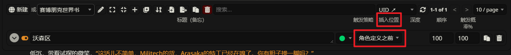

我们能够发现**插入位置**对应着的是**角色定义之前**，这是什么意思？

想要理解这些，我们首先需要知道，SillyTavern是如何发送数据给AI的。

当我们在SillyTavern上发送一条消息后，SillyTavern会按照以下顺序将数据发送给AI：

* 系统提示

* 角色定义/角色卡

* 作者注释

* 聊天历史

* 用户当前输入

而所谓的**插入位置：角色定义之前**指的就是把世界书条目的内容放置在角色卡之上，就像这样：

* 系统提示

* 世界书条目（角色定义之前）

* 角色定义/角色卡

* 作者注释

* 聊天历史

* 用户当前输入

插入位置的不同，AI的注意力也不同，因为这涉及**初始效应**和**近因效应**

简单来说就是AI会对开头和结尾给予更多的关注。

下面我将罗列所有的**插入位置**并标注AI的注意力强度以及影响类型

**(AI注意力强度：⭐ 非常弱 ... ⭐⭐⭐⭐⭐ 非常强)**  
**(影响类型：B=基础设定，C=上下文补充，I=即时影响，G=全局指令)**

1. **系统提示 (System Prompt / Main Prompt)**
   
   * **(⭐ ⭐ ⭐ ⭐ ⭐ | G)**
   
   * **说明：** 这是AI行为的最高级别指令。AI通常会高度重视这部分内容，并将其作为后续所有行为的基准。
   
   * **世界书插入点：** N/A (系统提示本身不是世界书的直接插入点，但世界书的第一个可能插入点紧随其后)

2. **世界书条目 (插入位置：@D ⚙️ 或类似“系统提示之后，角色定义之前”)**
   
   * **(⭐ ⭐ ⭐ ⭐ | B, G)**
   
   * **说明：** 紧随系统提示，在AI形成具体角色认知之前。适合放置**非常基础、普适性的世界规则、物理法则、核心背景设定**。AI会倾向于将此处的“事实”作为构建世界观的基础。
   
   * **AI注意力：** 相对较高，因为它们是早期接收到的“奠基石”信息。

3. **角色定义/角色卡 (Character Definition / Character Card - {{char}})**
   
   * **(⭐ ⭐ ⭐ ⭐ ⭐ | B)**
   
   * **说明：** AI的“自我认知”。AI会高度关注自身角色的描述，包括性格、背景、目标等。
   
   * **世界书插入点：** N/A (角色卡本身不是世界书的插入点，但世界书的下一个可能插入点紧随其后)

4. **世界书条目 (插入位置：@D 👤 或类似“角色定义之后，作者注释/聊天历史之前”)**
   
   * **(⭐ ⭐ ⭐ ⭐ | C, B)**
   
   * **说明：** **最常用和推荐的位置之一。** AI已经了解了自己是谁，现在接收关于其他角色、当前环境、相关事件、物品等的补充信息。这些信息直接丰富了AI对当前情境的理解。
   
   * **AI注意力：** 较高。信息与AI自身角色和即将展开的互动紧密相关。

5. **世界书条目 (插入位置：“作者注释之前”)**
   
   * **(⭐ ⭐ ⭐☆ | C)**
   
   * **说明：** 如果作者注释是用来提供场景或风格指导，那么在此之前插入的世界书信息可以被视为更“客观”的背景。与“角色定义之后”的位置非常接近，效果也类似。
   
   * **AI注意力：** 中高。取决于作者注释的具体内容和作用。

6. **作者注释 (Author's Note / AN)**
   
   * **(⭐ ⭐ ⭐ ⭐ | I, C, G)** (强度和类型取决于AN的内容和使用方式)
   
   * **说明：** 可以是场景描述、情绪引导、风格指示，甚至是临时的“元指令”。AI通常会比较重视AN，尤其是当AN写得明确且具有指导性时。
   
   * **世界书插入点：** N/A

7. **世界书条目 (插入位置：@D 🤖 或类似“作者注释之后，聊天历史之前”)**
   
   * **(⭐ ⭐ ⭐ | C, I)**
   
   * **说明：** AI已经处理了角色卡和作者注释。此处的信息可以看作是在回顾聊天历史前对当前状态的进一步补充或即时提醒。
   
   * **AI注意力：** 中等。信息的新鲜度较高，但可能不如AN或角色卡核心。

8. **世界书条目 (插入位置：↑EM - 聊天历史顶端，但在所有“元信息”之后)**
   
   * **(⭐ ⭐ ⭐☆ | C, I)**
   
   * **说明：** 放在聊天历史的最前面。AI在“阅读”具体对话前会先看到这些信息。适合那些需要在回顾对话前就被强调的上下文。
   
   * **AI注意力：** 中高。因为它比具体的聊天记录更早出现，可能作为理解后续对话的“引子”。

9. **聊天历史 (Chat History)**
   
   * **(⭐ ⭐ ⭐ ⭐ | C)** (越近的聊天历史注意力越强)
   
   * **说明：** AI通过聊天历史理解对话的来龙去脉。**最近的几条消息通常具有最高的注意力权重。**
   
   * **世界书插入点：** N/A (但世界书条目可以被设计成模拟聊天历史的一部分，或者在聊天历史中特定深度插入，但这更高级)

10. **世界书条目 (插入位置：↓EM - 聊天历史底端，用户当前输入之前)**
    
    * **(⭐ ⭐ ⭐ ⭐☆ | I)**
    
    * **说明：** 非常接近用户当前输入。这些信息是AI在生成回复前看到的“最后一眼”的上下文。适合放置**极其即时、与用户最新发言直接相关**的提醒或细节。
    
    * **AI注意力：** 较高到非常高，因为“近因效应”和与当前任务的直接相关性。

11. **用户当前输入 (User's Current Input - {{user}})**
    
    * **(⭐ ⭐ ⭐ ⭐ ⭐ | I)**
    
    * **说明：** AI需要直接回应的内容，具有最高的即时关注度。
    
    * **世界书插入点：** N/A

**补充说明：**

当我们选择了@D ⚙️、@D 👤、@D 🤖这三者的其中之一时，会有一个“深度”或“插入顺序”的设置

这个“深度”或“插入顺序”设置的含义是：**当有多个世界书条目（或其他模块的内容，如多个作者注释片段）被设置为插入到同一个锚点时，这个数字决定了它们在该锚点内部的相对排列顺序。**

**简单来说：**

* **锚点 (Anchor Point)：** 就是你选择的 @D ⚙️、@D 👤、@D 🤖 等。这决定了信息块将在提示的哪个“大区域”被插入。

* **深度/插入顺序 (Depth / Insertion Order)：** 决定了在那个“大区域”内部，如果同时有多个信息片段要放进去，它们的先后次序。

**工作原理和目的：**

1. **处理多个激活条目：**
   
   * 在一个对话回合中，可能会有多个世界书条目因为满足触发条件而被激活。
   
   * 如果这些被激活的条目碰巧都设置了相同的插入锚点（例如，有三个条目都设置了要在 @D 👤 即角色卡之后插入），那么SillyTavern就需要知道这三个条目应该以什么顺序排列在这个锚点之后。

2. **数字决定顺序：**
   
   * 通常情况下，**数字较小的“深度”或“插入顺序”会排在前面，数字较大的排在后面。**
   
   * 例如：
     
     * 条目A：锚点 @D 👤，深度 10
     
     * 条目B：锚点 @D 👤，深度 20
     
     * 条目C：锚点 @D 👤，深度 5
   
   * 当这三个条目都被激活并要在 @D 👤 之后插入时，它们的实际顺序会是：**条目C -> 条目A -> 条目B**。

**关于AI注意力的补充说明：**

* **“首要效应”和“近因效应”：** AI倾向于更关注提示的开头和结尾部分。

* **信息密度和清晰度：** 无论放在哪里，如果信息本身模糊、冗长或与当前情境无关，AI都可能“忽略”它。清晰、简洁、直接相关的信息更容易被“注意”和使用。

* **上下文窗口限制：** 如果提示总长度超过了AI的上下文窗口，即使是“蓝灯”条目，如果位置非常靠前且后续内容很多，其影响力也可能被削弱或完全“遗忘”。

* **模型差异：** 不同LLM对提示结构和信息顺序的敏感度可能不同。例如，一些指令调整模型可能对系统提示和明确的指令（如作者注释中的命令）更敏感。

* **“冲突”信息：** 如果不同位置的信息相互冲突，AI的行为可能变得不可预测。通常，更明确、更“权威”（如系统提示）或更新近的信息可能会占上风。

* **SillyTavern的“Smart Context”等功能：** 如果启用了这类功能，它们会动态地重排或选择聊天历史，这也会影响最终提示中信息的相对位置和AI的注意力分布。

### 2.5 结语

纵然已经费心竭力，但可能仍有不足之处，尽情见谅。
